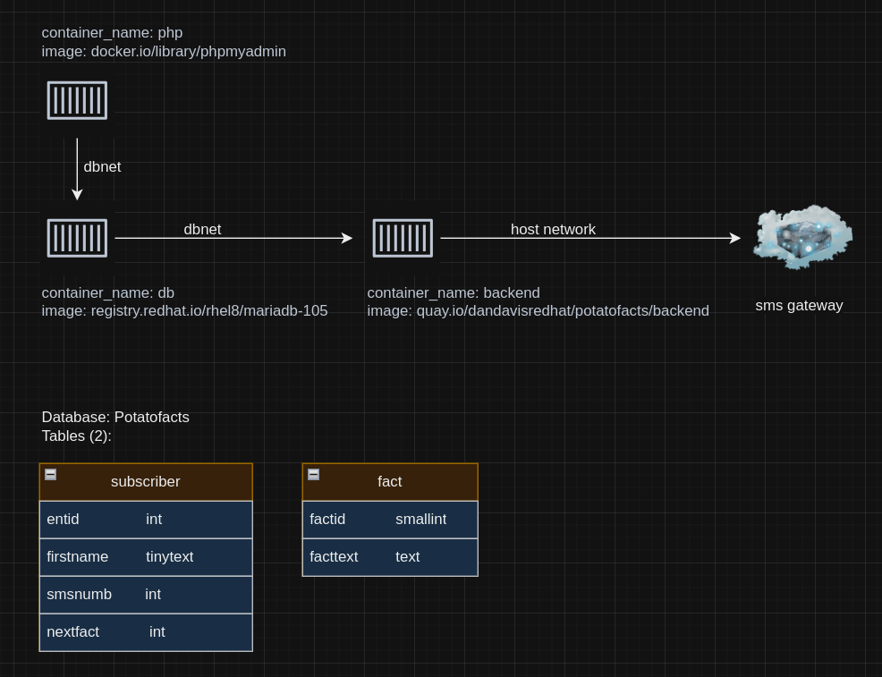

# potatofacts
A re-implementation of catfacts using podman

The goal of this hobby project will be to gain a better understanding of creating and running a 'composed' podman application.

The application will be a reimplementation of the catfacts prank [featured on Reddit](https://www.reddit.com/r/funny/comments/owx3v/so_my_little_cousin_posted_on_fb_that_he_was/).

The app will consist of a Mariadb database to hold subscriber information and facts about potatos, a python backend to take new subscriptions and serve catfacts from the database, and optionally a web frontend to facilitate new subscriptions. The python backend will interface with an SMS gateway that will enable it to send potato facts to SMS subscribers.

## TODO:
  - [x] Identify and test a podman database container-image suitable for the project goals
  - [x] Define the database tables necessary for the project
  - [x] Identify a podman container-image suitable for running the python backend
  - [ ] Write the backend python to serve potato facts, and interface with the SMS gateway
  - [ ] Rent time on an SMS gateway provider
  - [ ] Create a podman-compose file to start both containers together
  - [ ] QA/UAT
  - [ ] RELEASE

## OPTIONAL:
  - [ ] Web front end to take subscription requests
